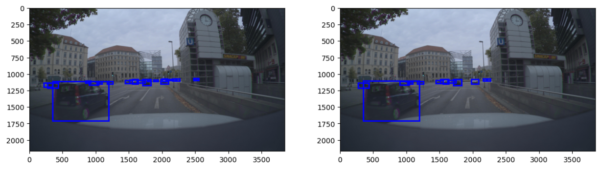

# Federated Self-supervised Learning (FSSL) for Autonomous Driving

This work applies FSSL and SSL on the Zenseact Open Dataset (ZOD) for the detection of other cars.

Steps to execute:
- Prepare resized bounding box data by running *prepare_df_boundingboxes.py*
- Train SSL or FSSL model via *train_simsiam.py* or *train_fedsimsiam.py*
- Train the Faster R-CNN which uses the trained backbone weights from the previous step by executing *train_fasterrcnn.py*
- Receive the AP score by running *test_fasterrcnn.py*

